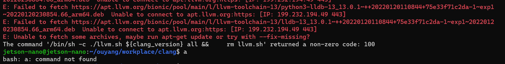

# ldt-cpp-deployment

2022-4-16 22:07:48


## clang-14

2022-4-16 22:07:52

目的：构建 clang-14 的 Docker 镜像。

预期结果：生成了 tag 为 `clang:14` 的 Docker 镜像。

注意：

1. 必须下载完整  `./llvm.sh ${clang_version} all`  (需要指定 `all`)，否则测试程序无法正常运行（找不到对应头文件）。
2. 下载很慢，应耐心等待。


- **dockerfile**:

  ```dockerfile
  # ubuntu 22.04
  FROM ubuntu:jammy-20220404
  
  ARG clang_version=14
  
  # docker build -t clang:xxx -f clang.Dockerfile .
  
  RUN set -ex && \
      mkdir -p /opt/workplace && \
      apt-get update 
  
  RUN apt-get install -y apt-utils curl wget unzip \
          lsb-release software-properties-common && \
      rm /bin/sh && \
      ln -sv /bin/bash /bin/sh && \
      chgrp root /etc/passwd && chmod ug+rw /etc/passwd 
  
  WORKDIR /opt/workplace 
  
  # llvm
  RUN wget https://apt.llvm.org/llvm.sh && \ 
      chmod +x llvm.sh 
  
  RUN ./llvm.sh ${clang_version} all && \ 
      rm llvm.sh 
  
  # A test program
  COPY cpp20example.cpp ./cpp20example.cpp
  
  RUN clang++-${clang_version} -std=c++20 -stdlib=libc++ cpp20example.cpp -o cpp20example.exe && \
      ./cpp20example.exe && \ 
      rm ./cpp20example.exe 
  ```
  
- **测试程序**：

  用于测试编译器是否安装成功（`filesystem` 是C++17特性，`concepts` 是C++20特性）

  ```cpp
  #include <filesystem>
  #include <concepts>
  #include <iostream>
   
  class A {};
   
  class B: public A {};
   
  class C: private A{};
   
  int main() {
      // std::derived_from == true only for public inheritance or exact same class
      static_assert( std::derived_from<B, B> == true );      // same class: true
      static_assert( std::derived_from<int, int> == false ); // same primitive type: false
      static_assert( std::derived_from<B, A> == true );      // public inheritance: true
      static_assert( std::derived_from<C, A> == false );     // private inheritance: false
   
      // std::is_base_of == true also for private inheritance
      static_assert( std::is_base_of_v<B, B> == true );      // same class: true
      static_assert( std::is_base_of_v<int, int> == false ); // same primitive type: false
      static_assert( std::is_base_of_v<A, B> == true );      // public inheritance: true
      static_assert( std::is_base_of_v<A, C> == true );      // private inheritance: true
      
      std::cout << "OK" << std::endl;
  }
  
  ```

- 镜像构建shell脚本

  ```sh
  docker build --build-arg clang_version=14 -t clang:14 -f clang.Dockerfile .
  ```

  

## clang-13 【失败】

2022-4-17 02:09:08

失败：



只使用华为镜像似乎不能解决问题。


清华镜像倒是提供了相关链接，但是不知道怎么用：

https://mirrors.tuna.tsinghua.edu.cn/llvm-apt/focal/dists/llvm-toolchain-focal-13/


- **dockerfile**:

  ```dockerfile
  # ubuntu 18.04
  FROM ubuntu:bionic-20220401
  
  ARG clang_version=13
  
  # docker build -t clang:xxx -f clang.Dockerfile .
  
  WORKDIR /opt/workplace 
  
  RUN set -ex && \
      mkdir -p /opt/workplace && \
      apt-get update && \ 
      apt-get install -y wget 
  
  # huawei repo: download acceleration
  RUN cp /etc/apt/sources.list /etc/apt/sources.list.bak && \
      wget -O /etc/apt/sources.list https://repo.huaweicloud.com/repository/conf/Ubuntu-Ports-bionic.list && \
      apt-get update 
  
  RUN apt-get upgrade -y
  
  RUN apt-get install -y apt-utils curl unzip \
          lsb-release software-properties-common && \
      rm /bin/sh && \
      ln -sv /bin/bash /bin/sh && \
      chgrp root /etc/passwd && chmod ug+rw /etc/passwd 
  
  # llvm
  RUN wget https://apt.llvm.org/llvm.sh && \ 
      chmod +x llvm.sh 
  
  RUN ./llvm.sh ${clang_version} all && \ 
      rm llvm.sh 
  
  
  ```

- **测试程序 dockerfile**：

  为了方便测试，测试部分单独创建镜像

  ```dockerfile
  ARG clang_version=13
  
  FROM clang:${clang_version}
  
  ARG clang_version=13
  
  # A test program
  COPY cpp20example.cpp ./cpp20example.cpp
  
  RUN clang++-${clang_version} -std=c++20 -stdlib=libc++ cpp20example.cpp -o cpp20example.exe && \
      ./cpp20example.exe && \ 
      rm ./cpp20example.exe 
  
  ```

  

## libtorch

2022-4-17 19:15:27

- 要用 clang 编译，别用 gcc。

  > [Install PyTorch on Raspberry Pi 4 - Q-engineering (qengineering.eu)](https://qengineering.eu/install-pytorch-on-raspberry-pi-4.html) 
  >
  > 这篇博客提到目前 gcc 对 ARM 架构的 NEON 支持有问题：
  >
  > - Before the build can begin, some preparations are required. First, you must have the latest clang compiler. There is a constant stream of [issues](https://github.com/pytorch/pytorch/issues/61110) with the GNU compiler. Usually, it has to do with poor support of the NEON architecture of the ARM cores, causing floating points to be erroneous or truncated.
  > - There are problems with the GCC optimization of intrinsics of the NEON registers of the ARM core, as shown above. It forces us to use the clang compiler. Therefore, when using the LibTorch API, you may be forced to use the clang compiler as well.
  >
  > 相关 issue：似乎会造成浮点数错误。

  

- 参考：https://github.com/pytorch/pytorch/blob/master/docs/libtorch.rst

  > **Building libtorch using CMake**
  >
  > You can build C++ libtorch.so directly with cmake. For example, to build a Release version from the master branch and install it in the directory specified by CMAKE_INSTALL_PREFIX below, you can use
  >
  > ```sh
  > git clone -b master --recurse-submodule https://github.com/pytorch/pytorch.git
  > mkdir pytorch-build
  > cd pytorch-build
  > cmake -DBUILD_SHARED_LIBS:BOOL=ON -DCMAKE_BUILD_TYPE:STRING=Release -DPYTHON_EXECUTABLE:PATH=`which python3` -DCMAKE_INSTALL_PREFIX:PATH=../pytorch-install ../pytorch
  > cmake --build . --target install
  > ```
  >
  > To use release branch v1.6.0, for example, replace `master` with `v1.6.0`. You will get errors if you do not have needed dependencies such as Python3's PyYAML package.

