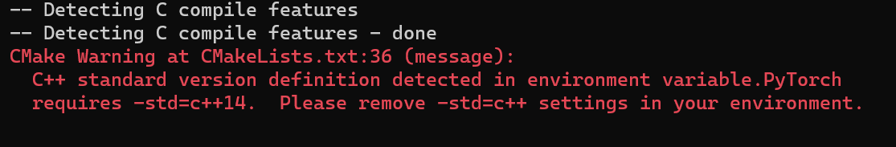
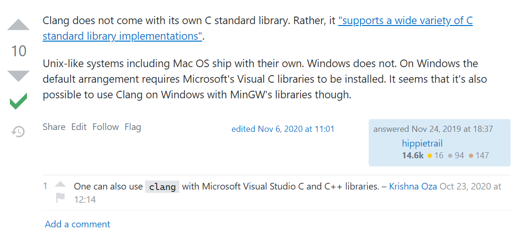

# README

2022-4-17 18:46:40


参考：https://github.com/pytorch/pytorch/blob/master/docs/libtorch.rst

> **Building libtorch using CMake**
>
> You can build C++ libtorch.so directly with cmake. For example, to build a Release version from the master branch and install it in the directory specified by CMAKE_INSTALL_PREFIX below, you can use
>
> ```sh
> git clone -b master --recurse-submodule https://github.com/pytorch/pytorch.git
> mkdir pytorch-build
> cd pytorch-build
> cmake -DBUILD_SHARED_LIBS:BOOL=ON -DCMAKE_BUILD_TYPE:STRING=Release -DPYTHON_EXECUTABLE:PATH=`which python3` -DCMAKE_INSTALL_PREFIX:PATH=../pytorch-install ../pytorch
> cmake --build . --target install
> ```
>
> To use release branch v1.6.0, for example, replace `master` with `v1.6.0`. You will get errors if you do not have needed dependencies such as Python3's PyYAML package.


___

## 关于代理问题

关键在于如何翻墙。如果做不到，就几乎无法成功下载源码。

而翻墙的关键又在于如何在构建镜像时设置 `HTTP_PROXY` 等相关环境变量。

根据下面的 stackoverflow 帖子，可以通过设置 `--build-arg` 的方式设置镜像构建时的环境变量。
原因是 Dockerfile 中的 `ARG` 会被自动设置为构建时环境变量。

https://stackoverflow.com/questions/27749193/how-to-build-docker-images-with-dockerfile-behind-http-proxy-by-jenkins


所以在不改动 Dockerfile 的前提下，只需改写一下 `buld_libtorch.sh` 代码，就能传入外部环境变量了。

```sh 
# build_libtorch.sh
LIBTORCH_VERSION=1.10.2
CLANG_VERSION=14
docker build \
    --build-arg https_proxy=$HTTP_PROXY --build-arg http_proxy=$HTTP_PROXY \
    --build-arg HTTP_PROXY=$HTTPS_PROXY --build-arg HTTPS_PROXY=$HTTPS_PROXY \
    --build-arg NO_PROXY=$NO_PROXY --build-arg no_proxy=$NO_PROXY \
    --build-arg libtorch_version=${LIBTORCH_VERSION} \
    --build-arg clang_version=${CLANG_VERSION} \
    -t libtorch:${LIBTORCH_VERSION} -f libtorch.Dockerfile .
```

如果使用 sudo 运行该脚本，应该添加 `-E` 选项。

否则进入 sudo 模式后会默认暂时清空当前用户的环境变量
（只有某些配置文件中的环境变量会被保留下来）。

> 加上 `-E`  选项后，用户可以在 `sudo`  执行时保留当前用户已存在的环境变量，不会被 `sudo` 重置。另外，如果用户对于指定的环境变量没有权限，则会报错。
> 博客链接：[分享一个解决 sudo 命令找不到环境变量的小技巧 - 云+社区 - 腾讯云 (tencent.com)](https://cloud.tencent.com/developer/article/1650340#:~:text=在通过 sudo 运行命令时，系统会默认重置环境变量为安全的环境变量，也就是说，先前设置的变量都会失效，只有少数配置文件中指定的环境变量能够保存下来。 sudo 的配置文件是 %2Fetc%2Fsudoers ，需要 root,%24 sudo sed '%2F^%23%2Fd%3B%2F^%24%2Fd' %2F etc %2F sudoers)

```sh
sudo -E bash build_libtorch.sh
```


## 编译 libtorch 时使用的 C++ 标准版本

根据提示，应该使用 `c++14`。但是这里的 warning 建议我不要设置。

```sh
CMake Warning at CMakeLists.txt:36 (message):
  C++ standard version definition detected in environment variable.PyTorch
  requires -std=c++14.  Please remove -std=c++ settings in your environment.
```




## C 语言部分

和 C++ 部分一样，`-stdlib=libc++`。

[printf - What standard C library does Clang use? glibc, its own, or some other one? - Stack Overflow](https://stackoverflow.com/questions/59019932/what-standard-c-library-does-clang-use-glibc-its-own-or-some-other-one)

> Clang does not come with its own C standard library. Rather, it ["supports a wide variety of C standard library implementations"](https://clang.llvm.org/docs/Toolchain.html#c-standard-library).

