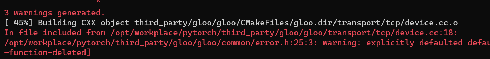

# log

2022-4-17 21:29:18


___

2022-4-17 21:29:23

```sh
-- ******** Summary ********
-- General:
--   CMake version         : 3.22.1
--   CMake command         : /usr/bin/cmake
--   System                : Linux
--   C++ compiler          : /usr/bin/clang++-14
--   C++ compiler id       : Clang
--   C++ compiler version  : 14.0.1
--   Using ccache if found : ON
--   Found ccache          : CCACHE_PROGRAM-NOTFOUND
--   CXX flags             : -stdlib=libc++ -Wno-deprecated -fvisibility-inlines-hidden -DUSE_PTHREADPOOL -fopenmp=libomp -DNDEBUG -DUSE_KINETO -DLIBKINETO_NOCUPTI -DUSE_QNNPACK -DUSE_PYTORCH_QNNPACK -DUSE_XNNPACK -DSYMBOLICATE_MOBILE_DEBUG_HANDLE -DEDGE_PROFILER_USE_KINETO -O2 -fPIC -Wno-narrowing -Wall -Wextra -Werror=return-type -Wno-missing-field-initializers -Wno-type-limits -Wno-array-bounds -Wno-unknown-pragmas -Wno-sign-compare -Wno-unused-parameter -Wno-unused-variable -Wno-unused-function -Wno-unused-result -Wno-unused-local-typedefs -Wno-strict-overflow -Wno-strict-aliasing -Wno-error=deprecated-declarations -Wno-error=pedantic -Wno-error=redundant-decls -Wno-error=old-style-cast -Wno-invalid-partial-specialization -Wno-typedef-redefinition -Wno-unknown-warning-option -Wno-unused-private-field -Wno-inconsistent-missing-override -Wno-aligned-allocation-unavailable -Wno-c++14-extensions -Wno-constexpr-not-const -Wno-missing-braces -Qunused-arguments -fcolor-diagnostics -Wno-unused-but-set-variable -Wno-maybe-uninitialized -fno-math-errno -fno-trapping-math -Werror=format -Werror=cast-function-type
--   Build type            : Release
--   Compile definitions   : ONNX_ML=1;ONNXIFI_ENABLE_EXT=1;ONNX_NAMESPACE=onnx_torch;HAVE_MMAP=1;_FILE_OFFSET_BITS=64;HAVE_SHM_OPEN=1;HAVE_SHM_UNLINK=1;HAVE_MALLOC_USABLE_SIZE=1;USE_EXTERNAL_MZCRC;MINIZ_DISABLE_ZIP_READER_CRC32_CHECKS
--   CMAKE_PREFIX_PATH     :
--   CMAKE_INSTALL_PREFIX  : ../pytorch-install
--   USE_GOLD_LINKER       : OFF
--
--   TORCH_VERSION         : 1.10.0
--   CAFFE2_VERSION        : 1.10.0
--   BUILD_CAFFE2          : ON
--   BUILD_CAFFE2_OPS      : ON
--   BUILD_CAFFE2_MOBILE   : OFF
--   BUILD_STATIC_RUNTIME_BENCHMARK: OFF
--   BUILD_TENSOREXPR_BENCHMARK: OFF
--   BUILD_BINARY          : OFF
--   BUILD_CUSTOM_PROTOBUF : ON
--     Link local protobuf : ON
--   BUILD_DOCS            : OFF
--   BUILD_PYTHON          : ON
--     Python version      : 3.10.4
--     Python executable   : /usr/bin/python3
--     Pythonlibs version  : 3.10.4
--     Python library      : /usr/lib/python3.10
--     Python includes     : /usr/include/python3.10
--     Python site-packages: lib/python3.10/dist-packages
--   BUILD_SHARED_LIBS     : ON
--   CAFFE2_USE_MSVC_STATIC_RUNTIME     : OFF
--   BUILD_TEST            : OFF
--   BUILD_JNI             : OFF
--   BUILD_MOBILE_AUTOGRAD : OFF
--   BUILD_LITE_INTERPRETER: OFF
--   INTERN_BUILD_MOBILE   :
--   USE_BLAS              : 0
--   USE_LAPACK            : 0
--   USE_ASAN              : OFF
--   USE_CPP_CODE_COVERAGE : OFF
--   USE_CUDA              : OFF
--   USE_ROCM              : OFF
--   USE_EIGEN_FOR_BLAS    : ON
--   USE_FBGEMM            : OFF
--     USE_FAKELOWP          : OFF
--   USE_KINETO            : ON
--   USE_FFMPEG            : OFF
--   USE_GFLAGS            : OFF
--   USE_GLOG              : OFF
--   USE_LEVELDB           : OFF
--   USE_LITE_PROTO        : OFF
--   USE_LMDB              : OFF
--   USE_METAL             : OFF
--   USE_PYTORCH_METAL     : OFF
--   USE_PYTORCH_METAL_EXPORT     : OFF
--   USE_FFTW              : OFF
--   USE_MKL               : OFF
--   USE_MKLDNN            : OFF
--   USE_NCCL              : OFF
--   USE_NNPACK            : ON
--   USE_NUMPY             : OFF
--   USE_OBSERVERS         : ON
--   USE_OPENCL            : OFF
--   USE_OPENCV            : OFF
--   USE_OPENMP            : ON
--   USE_TBB               : OFF
--   USE_VULKAN            : OFF
--   USE_PROF              : OFF
--   USE_QNNPACK           : ON
--   USE_PYTORCH_QNNPACK   : ON
--   USE_REDIS             : OFF
--   USE_ROCKSDB           : OFF
--   USE_ZMQ               : OFF
--   USE_DISTRIBUTED       : ON
--     USE_MPI               : OFF
--     USE_GLOO              : ON
--     USE_GLOO_WITH_OPENSSL : OFF
--     USE_TENSORPIPE        : ON
--   USE_DEPLOY           : OFF
--   USE_BREAKPAD         : ON
--   Public Dependencies  : Threads::Threads
--   Private Dependencies : pthreadpool;cpuinfo;qnnpack;pytorch_qnnpack;nnpack;XNNPACK;fp16;gloo;tensorpipe;aten_op_header_gen;foxi_loader;rt;fmt::fmt-header-only;kineto;dl
--   USE_COREML_DELEGATE     : OFF
-- Configuring done
-- Generating done
-- Build files have been written to: /opt/workplace/pytorch-build
```

出错：




```sh
[ 45%] Building CXX object third_party/gloo/gloo/CMakeFiles/gloo.dir/transport/tcp/device.cc.o
In file included from /opt/workplace/pytorch/third_party/gloo/gloo/transport/tcp/device.cc:18:
/opt/workplace/pytorch/third_party/gloo/gloo/common/error.h:25:3: warning: explicitly defaulted default constructor is implicitly deleted [-Wdefaulted-function-deleted]
  Exception() = default;
  ^
/opt/workplace/pytorch/third_party/gloo/gloo/common/error.h:24:20: note: default constructor of 'Exception' is implicitly deleted because base class 'std::runtime_error' has no default constructor
struct Exception : public std::runtime_error {
                   ^
/opt/workplace/pytorch/third_party/gloo/gloo/common/error.h:35:3: warning: explicitly defaulted default constructor is implicitly deleted [-Wdefaulted-function-deleted]
  InvalidOperationException() = default;
  ^
/opt/workplace/pytorch/third_party/gloo/gloo/common/error.h:34:36: note: default constructor of 'InvalidOperationException' is implicitly deleted because base class '::gloo::Exception' has a deleted default constructor
struct InvalidOperationException : public ::gloo::Exception {
                                   ^
/opt/workplace/pytorch/third_party/gloo/gloo/common/error.h:25:3: note: explicitly defaulted function was implicitly deleted here
  Exception() = default;
  ^
/opt/workplace/pytorch/third_party/gloo/gloo/common/error.h:24:20: note: default constructor of 'Exception' is implicitly deleted because base class 'std::runtime_error' has no default constructor
struct Exception : public std::runtime_error {
                   ^
/opt/workplace/pytorch/third_party/gloo/gloo/common/error.h:46:3: warning: explicitly defaulted default constructor is implicitly deleted [-Wdefaulted-function-deleted]
  IoException() = default;
  ^
/opt/workplace/pytorch/third_party/gloo/gloo/common/error.h:45:22: note: default constructor of 'IoException' is implicitly deleted because base class '::gloo::Exception' has a deleted default constructor
struct IoException : public ::gloo::Exception {
                     ^
/opt/workplace/pytorch/third_party/gloo/gloo/common/error.h:25:3: note: explicitly defaulted function was implicitly deleted here
  Exception() = default;
  ^
/opt/workplace/pytorch/third_party/gloo/gloo/common/error.h:24:20: note: default constructor of 'Exception' is implicitly deleted because base class 'std::runtime_error' has no default constructor
struct Exception : public std::runtime_error {
                   ^
/opt/workplace/pytorch/third_party/gloo/gloo/transport/tcp/device.cc:151:39: error: implicit instantiation of undefined template 'std::array<char, 64>'
      std::array<char, HOST_NAME_MAX> hostname;
                                      ^
/usr/lib/llvm-14/bin/../include/c++/v1/__tuple:219:64: note: template is declared here
template <class _Tp, size_t _Size> struct _LIBCPP_TEMPLATE_VIS array;
                                                               ^
3 warnings and 1 error generated.
gmake[2]: *** [third_party/gloo/gloo/CMakeFiles/gloo.dir/build.make:510: third_party/gloo/gloo/CMakeFiles/gloo.dir/transport/tcp/device.cc.o] Error 1
gmake[1]: *** [CMakeFiles/Makefile2:2101: third_party/gloo/gloo/CMakeFiles/gloo.dir/all] Error 2
gmake: *** [Makefile:146: all] Error 2
The command '/bin/sh -c set -ex &&     mkdir pytorch-build &&     cd pytorch-build &&     cmake -DBUILD_SHARED_LIBS:BOOL=ON         -DCMAKE_C_COMPILER=clang-${clang_version}         -DCMAKE_CXX_COMPILER=clang++-${clang_version}         -DCMAKE_C_FLAGS="-stdlib=libc++"         -DCMAKE_CXX_FLAGS="-stdlib=libc++"         -DCMAKE_BUILD_TYPE:STRING=Release         -DPYTHON_EXECUTABLE:PATH=`which python3`         -DCMAKE_INSTALL_PREFIX:PATH=../pytorch-install         ../pytorch &&     cmake --build . --target install' returned a non-zero code: 2
```

