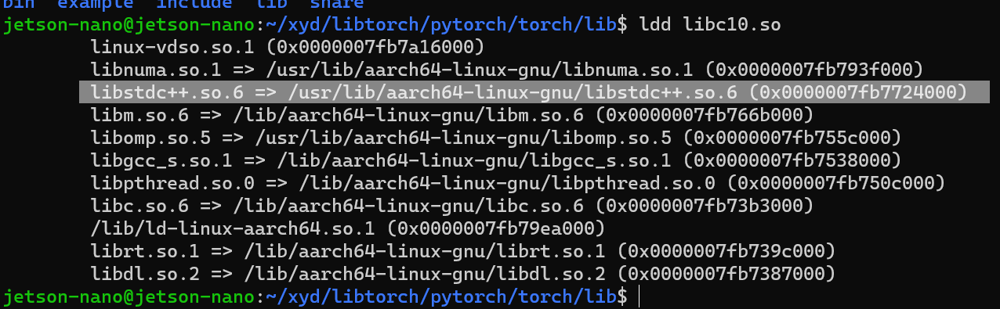

# 日志

2022-4-30 16:18:55


## 2022-4-30 16:18:56

```cpp
CMakeFiles/example-app.dir/example-app.cpp.o: In function `at::operator<<(std::__1::basic_ostream<char, std::__1::char_traits<char> >&, at::Tensor const&)':
example-app.cpp:(.text+0x218): undefined reference to `at::print(std::__1::basic_ostream<char, std::__1::char_traits<char> >&, at::Tensor const&, long)'
CMakeFiles/example-app.dir/example-app.cpp.o: In function `torch::autograd::make_variable(at::Tensor, bool, bool)':
example-app.cpp:(.text._ZN5torch8autograd13make_variableEN2at6TensorEbb[_ZN5torch8autograd13make_variableEN2at6TensorEbb]+0xd8): undefined reference to `c10::TensorImpl::set_autograd_meta(std::__1::unique_ptr<c10::AutogradMetaInterface, std::__1::default_delete<c10::AutogradMetaInterface> >)'
example-app.cpp:(.text._ZN5torch8autograd13make_variableEN2at6TensorEbb[_ZN5torch8autograd13make_variableEN2at6TensorEbb]+0x144): undefined reference to `c10::TensorImpl::set_autograd_meta(std::__1::unique_ptr<c10::AutogradMetaInterface, std::__1::default_delete<c10::AutogradMetaInterface> >)'
example-app.cpp:(.text._ZN5torch8autograd13make_variableEN2at6TensorEbb[_ZN5torch8autograd13make_variableEN2at6TensorEbb]+0x260): undefined reference to `c10::TensorImpl::set_autograd_meta(std::__1::unique_ptr<c10::AutogradMetaInterface, std::__1::default_delete<c10::AutogradMetaInterface> >)'
example-app.cpp:(.text._ZN5torch8autograd13make_variableEN2at6TensorEbb[_ZN5torch8autograd13make_variableEN2at6TensorEbb]+0x2e4): undefined reference to `c10::TensorImpl::set_autograd_meta(std::__1::unique_ptr<c10::AutogradMetaInterface, std::__1::default_delete<c10::AutogradMetaInterface> >)'
CMakeFiles/example-app.dir/example-app.cpp.o: In function `c10::Device::validate()':
example-app.cpp:(.text._ZN3c106Device8validateEv[_ZN3c106Device8validateEv]+0x8c): undefined reference to `c10::detail::torchInternalAssertFail(char const*, char const*, unsigned int, char const*, std::__1::basic_string<char, std::__1::char_traits<char>, std::__1::allocator<char> > const&)'
example-app.cpp:(.text._ZN3c106Device8validateEv[_ZN3c106Device8validateEv]+0x11c): undefined reference to `c10::detail::torchInternalAssertFail(char const*, char const*, unsigned int, char const*, std::__1::basic_string<char, std::__1::char_traits<char>, std::__1::allocator<char> > const&)'
CMakeFiles/example-app.dir/example-app.cpp.o: In function `torch::detail::TensorDataContainer::fill_tensor(at::Tensor&) const':
example-app.cpp:(.text._ZNK5torch6detail19TensorDataContainer11fill_tensorERN2at6TensorE[_ZNK5torch6detail19TensorDataContainer11fill_tensorERN2at6TensorE]+0x74): undefined reference to `c10::detail::torchInternalAssertFail(char const*, char const*, unsigned int, char const*, std::__1::basic_string<char, std::__1::char_traits<char>, std::__1::allocator<char> > const&)'
example-app.cpp:(.text._ZNK5torch6detail19TensorDataContainer11fill_tensorERN2at6TensorE[_ZNK5torch6detail19TensorDataContainer11fill_tensorERN2at6TensorE]+0x19c): undefined reference to `c10::detail::torchInternalAssertFail(char const*, char const*, unsigned int, char const*, std::__1::basic_string<char, std::__1::char_traits<char>, std::__1::allocator<char> > const&)'
CMakeFiles/example-app.dir/example-app.cpp.o: In function `caffe2::TypeMeta::fromScalarType(c10::ScalarType)':
example-app.cpp:(.text._ZN6caffe28TypeMeta14fromScalarTypeEN3c1010ScalarTypeE[_ZN6caffe28TypeMeta14fromScalarTypeEN3c1010ScalarTypeE]+0x64): undefined reference to `c10::detail::torchInternalAssertFail(char const*, char const*, unsigned int, char const*, std::__1::basic_string<char, std::__1::char_traits<char>, std::__1::allocator<char> > const&)'
clang: error: linker command failed with exit code 1 (use -v to see invocation)
CMakeFiles/example-app.dir/build.make:114: recipe for target 'example-app' failed
make[2]: *** [example-app] Error 1
CMakeFiles/Makefile2:82: recipe for target 'CMakeFiles/example-app.dir/all' failed
make[1]: *** [CMakeFiles/example-app.dir/all] Error 2
Makefile:90: recipe for target 'all' failed
make: *** [all] Error 2
```


## 2022-4-30 17:27:22




> WO:
> 问个问题啊
>
> WO:
> [图片]
>
> WO:
> 你下的这个 libtorch 真的是用 clang 编译的吗？
>
> WO:
> 虽然不太懂clang，但我看到的链接依赖全是 GNU 的
>
> Aibo:
> 我去，这个为啥是libstdc++啊
>
> Aibo:
> 那肯定不对
>
> Aibo:
> 那就不是用clang编译出来的，怪不得
>
> WO:
> 有一种可能
>
> WO:
> 就是他用 clang 编译器，但没用 clang 标准库
>
> WO:
> 如果是这样，我们用他编译的版本就是徒劳的
>
> Aibo:
> 是，用的是libstdc++的库肯定不对