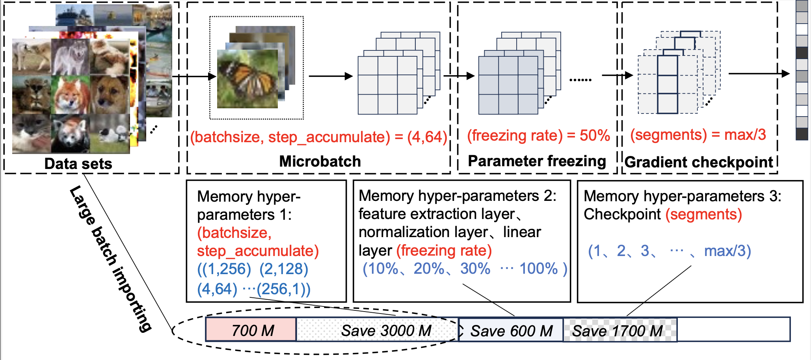
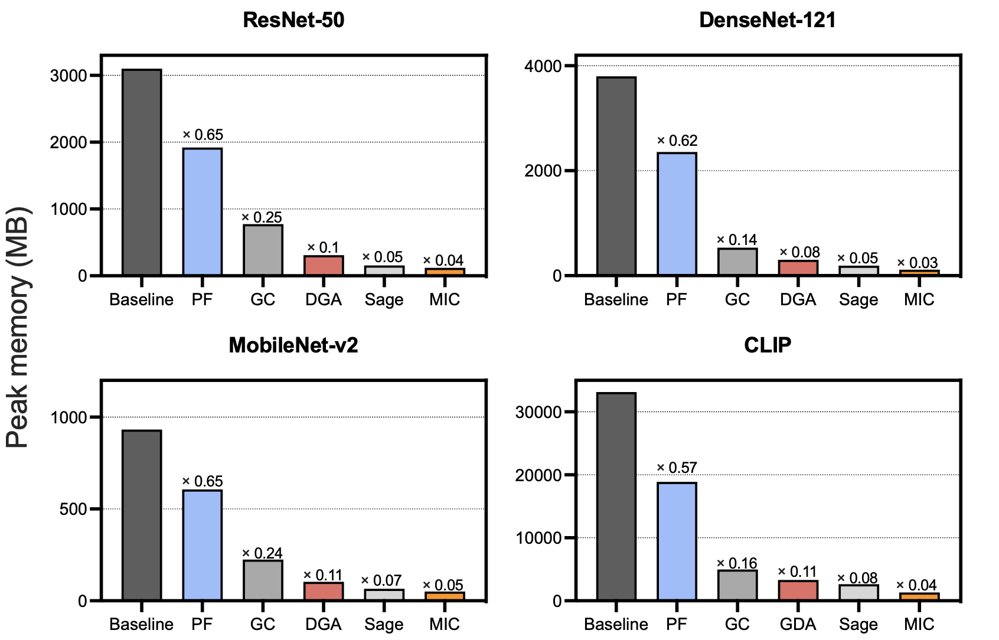

# MPOptimizer


## Table of contents

## 1 Introduction

 MPOptimizer can optimize configurations of *m*-hyperparameters for dynamic input distributions and available resources in edge-based retraining tasks. The core component of MPOptimizer is an online resource profiler that efficiently analyze the resource and accuracy of different *m*- hyperparameter configurations and a rule engine that quickly search the large configuration space based on different rules. MPOptimizer is implemented on PyTorch and evaluated against state-of-the-art *m*- hyperparameters optimization techniques to demonstrate its improvement in both model accuracy and training performance.

The following model support is now available：

- [ResNet](https://openaccess.thecvf.com/content_cvpr_2016/html/He_Deep_Residual_Learning_CVPR_2016_paper.html): This model consists of multiple convolutional layers and pooling layers that extract the information in image. Typically, ResNet suffers from gradient vanishing (exploding) and performance degrading when the network is deep. ResNet thus adds BatchNorm to alleviate gradient vanishing (exploding) and adds residual connection to alleviate the performance degrading.

- [MobileNet](https://arxiv.org/abs/1801.04381): MobileNet is a lightweight convolutional network which widely uses the depthwise separable convolution.
- [ResNeXt](https://arxiv.org/abs/1611.05431): ResNeXt combines Inception and ResNet. It first simplifies the Inception Module to make each of its branch have the same structure and then constructs the network as ResNet-style.
- [MobileViT](https://github.com/chinhsuanwu/mobilevit-pytorch):MobileviT is a lightweight, general-purpose visualization transformer for mobile devices.
- [DenseNet](https://arxiv.org/pdf/1608.06993.pdf):The core feature of DenseNet is its unique dense connectivity mechanism, which enables each layer in the network to connect directly or indirectly to all other layers, thus making full use of the feature information.
- [CLIP](https://github.com/OpenAI/CLIP):CLIP (Contrastive Language-Image Pre-Training) is a neural network trained on a variety of (image, text) pairs. It can be instructed in natural language to predict the most relevant text snippet, given an image, without directly optimizing for the task, similarly to the zero-shot capabilities of GPT-2 and 3. 

## 2 How to get started

### 2.1 Setup

#### requirements

- Edge devices such as Jetson AGX, Jetson TX2, Jetson Xavier NX and Jetson Nano
- Linux
- Python 3.8.5
- PyTorch 1.7.1
- CUDA 10.2+
- cuDNN 7.6.4
- Redis 6.0.10

#### **Preparing the virtual environment**

1. Create a conda environment and activate it.

``````shell
conda create -n MPOptimizer python=3.8
conda active MPOptimizer
``````

2. Install PyTorch 1.7+ in the [offical website](https://pytorch.org/). A NVIDIA graphics card and PyTorch with CUDA are recommended.


3. Clone this repository and install the dependencies.

``````shell
git clone https://github.com/LINC-BIT/MPOptimizer.git
pip install -r requirements.txt
cd Docker/libtorch
touch Dockerfile
``````

### 2.2 Usage

- **Single device**

  Run MPOptimizer or the baselines:

  ```````shell
  python pre_train_xxx.py
  python re_train.py
  python memonger.py
  python re_test.py
  ```````

```
python MPOptimizer/src/test.py --dataset [dataset] --model [model] 
--hyperparameters [hyper_parameters] --lr [lr] --task [task] 
--epoch [epoch] --store_rate [store_rate] --gpu [gpu]
```

Arguments:

- ``dataset``: the dataset, e.g. ``cifar10-c``, ``digits``, ``office-31``
- ``model``: the model, e.g. ``ResNet-50``, ``ResNet-101``, ``MobileNet-v2``, ``MobileVit``
- ``hyperparameters``: the *m*-hyperparameters, e.g. ``batchsize``, ``step_accumulate``, ``freezing_rate``, ``segment``
- ``lr``: the learning rate
- ``task``: the number of tasks
- ``epoch``: the number of retraining epochs
- ``store_rate``: the store rate of model parameters
- ``gpu``: GPU id

## 3 Supported models

|      |                          Model Name                          |                             Data                             |                            Script                            |
| ---- | :----------------------------------------------------------: | :----------------------------------------------------------: | :----------------------------------------------------------: |
| ☑    | [MobileViT (ICLR'22)](https://github.com/chinhsuanwu/mobilevit-pytorch) |    [Cifar100](http://www.cs.toronto.edu/~kriz/cifar.html)    | [Demo](https://github.com/LINC-BIT/MPOptimizer/model/MobileViT/re_train.py) |
| ☑    | [ResNet (CVPR'2016)](https://openaccess.thecvf.com/content_cvpr_2016/html/He_Deep_Residual_Learning_CVPR_2016_paper.html) |    [Cifar100](http://www.cs.toronto.edu/~kriz/cifar.html)    | [Demo](https://github.com/LINC-BIT/MPOptimizer/model/ResNet/re_train.py) |
| ☑    | [MobileNetV2 (CVPR'2018)](https://openaccess.thecvf.com/content_cvpr_2018/html/Sandler_MobileNetV2_Inverted_Residuals_CVPR_2018_paper.html) |    [Cifar100](http://www.cs.toronto.edu/~kriz/cifar.html)    | [Demo](https://github.com/LINC-BIT/MPOptimizer/model/MobileNet/re_train.py) |
| ☑    | [ResNeXt (CVPR'2017)](https://openaccess.thecvf.com/content_cvpr_2017/html/Xie_Aggregated_Residual_Transformations_CVPR_2017_paper.html) |    [Cifar100](http://www.cs.toronto.edu/~kriz/cifar.html)    | [Demo](https://github.com/LINC-BIT/MPOptimizer/model/ResNet/re_train.py) |
| ☑    |       [DenseNet](https://arxiv.org/pdf/1608.06993.pdf)       |    [Cifar100](http://www.cs.toronto.edu/~kriz/cifar.html)    | [Demo](https://github.com/LINC-BIT/MPOptimizer/model/ResNet/re_train.py) |
| ☑    |            [CLIP](https://github.com/OpenAI/CLIP)            | [GTA5](https://link.springer.com/chapter/10.1007/978-3-319-46475-6_7) | [Demo](https://github.com/LINC-BIT/MPOptimizer/BIG_model/new_impl/cv/clip/clip.py) |

## 4 Implementation

### 4.1 Memory-related Hyperparameters Extraction



MPOptimizer integrates three techniques (microbatch, parameter freezing, and gradient checkpoints) in a unified model and sets up a scheme that allows for dynamic adjustment of these techniques. We call them memory-related hyperparameters, and the figure above shows the memory-related hyperparameters for each technique, allowing the user to choose whether to adjust them manually or to use the automated search scheme we have implemented.

### 4.2 Resource Profiling Algorithm

Our target retraining tasks are configured based on existing pre-training data. Therefore, how to efficiently use the resource consumption data obtained in the pre-training phase to estimate the online resource consumption in the re-training phase is the main problem we need to solve. To this end, we designed algorithms for resource profiling to complete rapid estimation of online resources.

```python
    def track(self):
        frameinfo = inspect.stack()[1]
        where_str = frameinfo.filename + ' line ' + str(frameinfo.lineno) + ': ' + frameinfo.function

        with open(self.gpu_profile_fn, 'a+') as f:

            if self.begin:
                f.write(f"GPU Memory Track | {datetime.datetime.now():%d-%b-%y-%H:%M:%S} |"
                        f" Total Tensor Used Memory:{self.get_tensor_usage():<7.1f}Mb"
                        f" Total Allocated Memory:{self.get_allocate_usage():<7.1f}Mb\n\n")
                self.begin = False

            if self.print_detail is True:
                ts_list = [(tensor.size(), tensor.dtype) for tensor in self.get_tensors()]
                new_tensor_sizes = {(type(x),
                                    tuple(x.size()),
                                    ts_list.count((x.size(), x.dtype)),
                                    np.prod(np.array(x.size()))*get_mem_space(x.dtype)/1024**2,
                                    x.dtype) for x in self.get_tensors()}
                for t, s, n, m, data_type in new_tensor_sizes - self.last_tensor_sizes:
                    f.write(f'+ | {str(n)} * Size:{str(s):<20} | Memory: {str(m*n)[:6]} M | {str(t):<20} | {data_type}\n')
                for t, s, n, m, data_type in self.last_tensor_sizes - new_tensor_sizes:
                    f.write(f'- | {str(n)} * Size:{str(s):<20} | Memory: {str(m*n)[:6]} M | {str(t):<20} | {data_type}\n')

                self.last_tensor_sizes = new_tensor_sizes

            f.write(f"\nAt {where_str:<50}"
                    f" Total Tensor Used Memory:{self.get_tensor_usage():<7.1f}Mb"
                    f" Total Allocated Memory:{self.get_allocate_usage():<7.1f}Mb\n\n")
```

### 4.3 Accuracy Improvement Algorithm

When performing memory hyperparameter search, traditional methods generally do not consider the impact of hyperparameters on model training accuracy. However, for online unsupervised retraining tasks whose training itself is very unstable, this may cause rapid loss of accuracy and worse training results. To this end, we propose an accuracy improvement algorithm that searches for memory hyperparameters while ensuring that a hyperparameter configuration with higher accuracy improvement efficiency is selected.

```python
def Aco(microbatch_size,checkpoint_size,freezing_rate):
    acc_i=get_acc()
	retrain(microbatch_size,checkpoint_size,freezing_rate,t)
    acc_f=get_acc()
    budget=budget-t
    return (acc_f-acc_i)/t
# return the accuracy gain
i=0
gain=dict()
for k in K_parameter:
    microbatch_size=k[0]
    checkpoint_size=k[1]
    freezing_rate=k[2]
    gain[i]=Aco(microbatch_size,checkpoint_size,freezing_rate)
    i=i+1

sorted(gain.items(),key=lambda x:-x[1])

while budget > t:
    for item,acc in gain.items():
        microbatch_size=K_parameter[item][0]
        checkpoint_size=K_parameter[item][1]
        freezing_rate=K_parameter[item][2]
        gain[item]=Aco(microbatch_size,checkpoint_size,freezing_rate)
        break
    sorted(gain.items(),key=lambda x:-x[1])
```

### Dataset

If you want integrate a new dataset, you can do like this. The steps are:

1. create a class (inherited from `benchmark.data.datasets.ab_dataset.ABDataset`), e.g. `class YourDataset(ABDataset)`

2. register your dataset with `benchmark.data.datasets.registry.dataset_register(name, classes, classes_aliases)`, which represents the name of your dataset, the classes of your dataset, and the possible aliases of the classes. Examples refer to `benchmark/data/datasets/image_classification/cifar10.py` or other files.

   Note that the order of `classes` must match the indexes. For example, `classes` of MNIST must be `['0', '1', '2', ..., '9']`, which means 0-th class is '0', 1-st class is '1', 2-nd class is '2', ...; `['1', '2', '0', ...]` is not correct because 0-th class is not '1' and 1-st class is not '2'.

   How to get `classes` of a dataset? For PyTorch built-in dataset (CIFAR10, MNIST, ...) and general dataset build by `ImageFolder`, you can initialize it (e.g. `dataset = CIFAR10(...)`) and get its classes by `dataset.classes`.

   ```python
   # How to get classes in CIFAR10?
   from torchvision.datasets import CIFAR10
   dataset = CIFAR10(...)
   print(dataset.classes)
   # copy this output to @dataset_register(classes=<what you copied>)
   
   # it's not recommended to dynamically get classes, e.g.:
   # this works but runs slowly!
   from torchvision.datasets import CIFAR10 as RawCIFAR10
   dataset = RawCIFAR10(...)
   
   @dataset_register(
   	name='CIFAR10',
       classes=dataset.classes
   )
   class CIFAR10(ABDataset):
       # ...
   ```

3. For object detection dataset, you can read the annotation JSON file and find `categories` information in it.

4. implement abstract function `create_dataset(self, root_dir: str, split: str, transform: Optional[Compose], classes: List[str], ignore_classes: List[str], idx_map: Optional[Dict[int, int]])`.

   Arguments:

   - `root_dir`: the location of data
   - `split`: `train / val / test`
   - `transform`: preprocess function in `torchvision.transforms`
   - `classes`: the same value with `dataset_register.classes`
   - `ignore_classes`: **classes should be discarded. You should remove images which belong to these ignore classes.**
   - `idx_map`: **map the original class index to new class index. For example, `{0: 2}` means the index of 0-th class will be 2 instead of 0. You should implement this by modifying the stored labels in the original dataset. **

   You should do five things in this function:

   1. if no user-defined transform is passed, you should implemented the default transform
   2. create the original dataset
   3. remove ignored classes in the original dataset if there are ignored classes
   4. map the original class index to new class index if there is index map
   5. split the original dataset to train / val / test dataset. If there's no val dataset in original dataset (e.g. DomainNetReal), you should split the original dataset to train / val / test dataset. If there's already val dataset in original dataset (e.g. CIFAR10 and ImageNet), regard the original val dataset as test dataset, and split the original train dataset into train / val dataset. Details just refer to existed files.

   Example:

   ```python
   @dataset_register(
       name='CIFAR10', 
       # means in the original CIFAR10, 0-th class is airplane, 1-st class is automobile, ...
       classes=['airplane', 'automobile', 'bird', 'cat', 'deer', 'dog', 'frog', 'horse', 'ship', 'truck'], 
       task_type='Image Classification',
       # means 'automobile' and 'car' are the same thing actually
       class_aliases=[['automobile', 'car']],
       shift_type=None
   )
   class CIFAR10(ABDataset):    
       def create_dataset(self, root_dir: str, split: str, transform: Optional[Compose], 
                          classes: List[str], ignore_classes: List[str], idx_map: Optional[Dict[int, int]]):
           # 1. if no user-defined transform is passed, you should implemented the default transform
           if transform is None:
               transform = cifar_like_image_train_aug() if split == 'train' else cifar_like_image_test_aug()
               self.transform = transform
           # 2. create the original dataset
           dataset = RawCIFAR10(root_dir, split != 'test', transform=transform, download=True)
           
           # 3. remove ignored classes in the original dataset if there are ignored classes
           dataset.targets = np.asarray(dataset.targets)
           if len(ignore_classes) > 0: 
               for ignore_class in ignore_classes:
                   dataset.data = dataset.data[dataset.targets != classes.index(ignore_class)]
                   dataset.targets = dataset.targets[dataset.targets != classes.index(ignore_class)]
           
           # 4. map the original class index to new class index if there is index map
           if idx_map is not None:
               for ti, t in enumerate(dataset.targets):
                   dataset.targets[ti] = idx_map[t]
           
           # 5. split the original dataset to train / val / test dataset.
           # there is not val dataset in CIFAR10 dataset, so we split the val dataset from the train dataset.
           if split != 'test':
               dataset = train_val_split(dataset, split)
           return dataset
   ```

## 5 Experiments setting

#### 5.1 Accuracy Performance for Edge-based Retraining Tasks

##### 5.1.1 Dataset introduction

- CIFAR-10-C: The CIFAR-10-C dataset comprises 15 distinct categories of corruptions, such as Gaus- sian noise, blur, snow, frost, fog, contrast, and others. Each corruption category includes 5 severity levels, thereby offering a diverse set of challenging scenarios for evaluation. 
- **Homepage**:https://github.com/hendrycks/robustness
- **Source code**: [`tfds.image_classification.Cifar10Corrupted`](https://github.com/tensorflow/datasets/tree/master/tensorflow_datasets/image_classification/cifar10_corrupted.py)
- **Download size**: `2.72 GiB`

##### 5.1.2 Retraining tasks

The next section describes how to run the retraining task on the CIFAR-10-C dataset:

- Split the CIFAR-10-C dataset into different domain adaptation tasks:

```
python src/dataset.py -cifar10_c
```

- Perform pre-training neural network tasks

```
python src/pre-train.py
```

- Conduct domain adaptation retraining tasks

```
python src/re-train.py
```

- Accuracy validation on benchmark

```
python src/re_test.py
```

##### 5.1.3 Hyperparameters analysis

- Analysis of resources

```
python estimator/gpu_mem_track.py
```

- Analysis of accuracy performance

```
python estimator/accuracy_estimator.py
```

##### 5.1.4 Evaluation of the effectiveness of memory optimization



While training the model, we get the memory optimization strength of the different techniques by looking at the TensorBoard, and the figure shows the leading optimization performance of the integrated control module MIC in MPOptimizer.

#### 5.2 Transfer learning tasks

##### 5.2.1 Dataset introduction

- Office-31: The Office dataset contains 31 object categories in three domains: Amazon, DSLR and Webcam. The 31 categories in the dataset consist of objects commonly encountered in office settings, such as keyboards, file cabinets, and laptops. The Amazon domain contains on average 90 images per class and 2817 images in total. As these images were captured from a website of online merchants, they are captured against clean background and at a unified scale. The DSLR domain contains 498 low-noise high resolution images (4288×2848). There are 5 objects per category. Each object was captured from different viewpoints on average 3 times. For Webcam, the 795 images of low resolution (640×480) exhibit significant noise and color as well as white balance artifacts.
- **Homepage**:https://faculty.cc.gatech.edu/~judy/domainadapt/

##### 5.2.2 How to start

- Split the CIFAR-10-C dataset into different transfer learning tasks:

```
python src/dataset.py -office_31
```

- Perform pre-training neural network tasks

```
python src/pre-train-office.py
```

- Conduct transfer learning retraining tasks

```
python src/re_train_office.py
```

- Accuracy validation on benchmark

```
python src/re_test_office.py
```

#### 5.3 Digits tasks

##### 5.2.1 Dataset introduction

- Digits: This dataset is made up of 1797 8x8 images. Each image, like the one shown below, is of a hand-written digit. In order to utilize an 8x8 figure like this, we’d have to first transform it into a feature vector with length 64.
- **Homepage**:https://archive.ics.uci.edu/ml/machine-learning-databases/optdigits/

##### 5.2.2 How to start

- Split the digits dataset into different tasks:

```
python src/DigitModel.py
```

- Perform pre-training neural network tasks

```
python src/pre-train-svnh.py
python src/pre-train-usps.py
```

- Conduct retraining tasks

```
python src/re_train.py
```

- Accuracy validation on benchmark

```
python src/re_test_svnh.py
```

#### 5.4 Big model

We implemented a memory optimization support work for large models in Hugging Face based on the prior work EdgeTA. Including Vision Transformer, CLIP, SAM, GLIP, GPT-Neo and so on. Among them, the pre-training time of CLIP is shorter, so it is easy for users to test, here we focus on the running process of this work, and the rest of the work users can refer to the directory file to test by themselves.

- Experimental settings

**Models.** We use a image classification model based on CLIP from Hugging Face as an example to explain how to connect a Hugging Face FM to the MPOptimizer.

**Datasets.** We use datasets [GTA5](https://link.springer.com/chapter/10.1007/978-3-319-46475-6_7) and [SuperviselyPerson](https://supervise.ly/) as the source domain, and datasets [Cityscapes](https://openaccess.thecvf.com/content_cvpr_2016/html/Cordts_The_Cityscapes_Dataset_CVPR_2016_paper.html) and [BaiduPerson](https://ieeexplore.ieee.org/abstract/document/6976983) as the target domain. We convert these semantic segmentation datasets into image classification datasets by cropping and saving the images in the segmentation bounding boxes.

- Front-end pre-training work

Run the following command sequentially to pre-train the knowledge base and index:

```shell
python Big_model/new_impl/cv/clip/cls.py
python Big_model/new_impl/cv/clip/cls_md_wo_fbs.py
python Big_model/new_impl/cv/clip/cls_md_index.py
//Note that the file path of the model checkpoint in last two files should be modified manually.
```

- Online retraining phase

Run the following command to evaluate MPOptimizer over evolving data:

```shell
python estimator/gpu_mem_track.py
python estimator/accuracy_estimator.py
python Big_model/new_impl/cv/clip/cls_online.py
```


