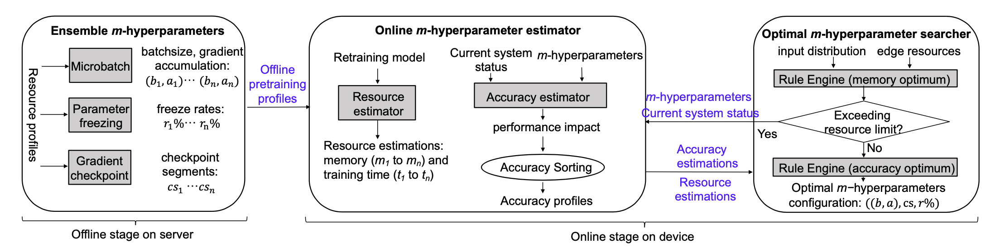

# MPOptimizer



## Table of contents

## 1 Introduction

 MPOptimizer can optimize configurations of *m*-hyperparameters for dynamic input distributions and available resources in edge-based retraining tasks. The core component of MPOptimizer is an online estimator that efficiently analyze the resource and accuracy of different *m*- hyperparameter configurations and a runtime searcher that quickly search the large configuration space based on rule engine and effective search rules. MPOptimizer is implemented on PyTorch and evaluated against state-of-the-art *m*- hyperparameters optimization techniques to demonstrate its improvement in both model accuracy and training performance.

The following model support is now available：

- [ResNet](https://openaccess.thecvf.com/content_cvpr_2016/html/He_Deep_Residual_Learning_CVPR_2016_paper.html): this model consists of multiple convolutional layers and pooling layers that extract the information in image. Typically, ResNet suffers from gradient vanishing (exploding) and performance degrading when the network is deep. ResNet thus adds BatchNorm to alleviate gradient vanishing (exploding) and adds residual connection to alleviate the performance degrading.

- [MobileNet](https://arxiv.org/abs/1801.04381): MobileNet is a lightweight convolutional network which widely uses the depthwise separable convolution.
- [ResNeXt](https://arxiv.org/abs/1611.05431): ResNeXt combines Inception and ResNet. It first simplifies the Inception Module to make each of its branch have the same structure and then constructs the network as ResNet-style.
- [MobileViT](https://github.com/chinhsuanwu/mobilevit-pytorch):MobileviT is a lightweight, general-purpose visualization transformer for mobile devices.

## 2 How to get started

### 2.1 Setup

#### requirements

- Edge devices such as Jetson AGX, Jetson TX2, Jetson Xavier NX and Jetson Nano
- Linux
- Python 3.8+
- PyTorch 1.10+
- CUDA 10.2+

#### **Preparing the virtual environment**

1. Create a conda environment and activate it.

``````shell
conda create -n MPOptimizer python=3.8
conda active MPOptimizer
``````

2. Install PyTorch 1.9+ in the [offical website](https://pytorch.org/). A NVIDIA graphics card and PyTorch with CUDA are recommended.
3. Install PyTorch 1.10+ in the [offical website](https://pytorch.org/). A NVIDIA graphics card and PyTorch with CUDA are recommended.
4. Clone this repository and install the dependencies.

``````shell
git clone https://github.com/LINC-BIT/MPOptimizer.git
pip install -r requirements.txt
cd Docker/libtorch
touch Dockerfile
``````

### 2.2 Usage

- **Single device**

  Run MPOptimizer or the baselines:

  ```````shell
  python pre_train_xxx.py
  python re_train.py
  python memonger.py
  python re_test.py
  ```````

### 3 Supported models

|      |                          Model Name                          |                          Data                          |                            Script                            |
| ---- | :----------------------------------------------------------: | :----------------------------------------------------: | :----------------------------------------------------------: |
| ☑    | [MobileViT (ICLR'22)](https://github.com/chinhsuanwu/mobilevit-pytorch) | [Cifar100](http://www.cs.toronto.edu/~kriz/cifar.html) | [Demo](https://github.com/LINC-BIT/MPOptimizer/model/MobileViT/re_train.py) |
| ☑    | [ResNet (CVPR'2016)](https://openaccess.thecvf.com/content_cvpr_2016/html/He_Deep_Residual_Learning_CVPR_2016_paper.html) | [Cifar100](http://www.cs.toronto.edu/~kriz/cifar.html) | [Demo](https://github.com/LINC-BIT/MPOptimizer/model/ResNet/re_train.py) |
| ☑    | [MobileNetV2 (CVPR'2018)](https://openaccess.thecvf.com/content_cvpr_2018/html/Sandler_MobileNetV2_Inverted_Residuals_CVPR_2018_paper.html) | [Cifar100](http://www.cs.toronto.edu/~kriz/cifar.html) | [Demo](https://github.com/LINC-BIT/MPOptimizer/model/MobileNet/re_train.py) |
| ☑    | [ResNeXt (CVPR'2017)](https://openaccess.thecvf.com/content_cvpr_2017/html/Xie_Aggregated_Residual_Transformations_CVPR_2017_paper.html) | [Cifar100](http://www.cs.toronto.edu/~kriz/cifar.html) | [Demo](https://github.com/LINC-BIT/MPOptimizer/model/ResNet/re_train.py) |
