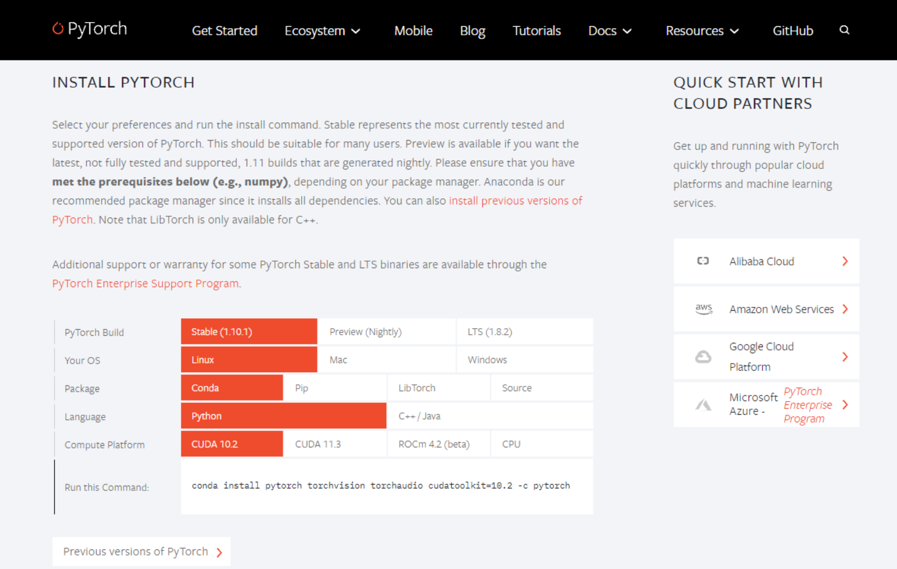

# MPOptimizer


## Table of contents

## 1 Introduction

 MPOptimizer can optimize configurations of *m*-hyperparameters for dynamic input distributions and available resources in edge-based retraining tasks. The core component of MPOptimizer is an online resource profiler that efficiently analyze the resource and accuracy of different *m*- hyperparameter configurations and a rule engine that quickly search the large configuration space based on different rules. MPOptimizer is implemented on PyTorch and evaluated against state-of-the-art *m*- hyperparameters optimization techniques to demonstrate its improvement in both model accuracy and training performance.

The following model support is now available：

- [ResNet](https://openaccess.thecvf.com/content_cvpr_2016/html/He_Deep_Residual_Learning_CVPR_2016_paper.html): this model consists of multiple convolutional layers and pooling layers that extract the information in image. Typically, ResNet suffers from gradient vanishing (exploding) and performance degrading when the network is deep. ResNet thus adds BatchNorm to alleviate gradient vanishing (exploding) and adds residual connection to alleviate the performance degrading.

- [MobileNet](https://arxiv.org/abs/1801.04381): MobileNet is a lightweight convolutional network which widely uses the depthwise separable convolution.
- [ResNeXt](https://arxiv.org/abs/1611.05431): ResNeXt combines Inception and ResNet. It first simplifies the Inception Module to make each of its branch have the same structure and then constructs the network as ResNet-style.
- [MobileViT](https://github.com/chinhsuanwu/mobilevit-pytorch):MobileviT is a lightweight, general-purpose visualization transformer for mobile devices.

## 2 How to get started

### 2.1 Setup

#### requirements

- Edge devices such as Jetson AGX, Jetson TX2, Jetson Xavier NX and Jetson Nano
- Linux
- Python 3.8.5
- PyTorch 1.7.1
- CUDA 10.2+
- cuDNN 7.6.4
- Redis 6.0.10

#### **Preparing the virtual environment**

1. Create a conda environment and activate it.

``````shell
conda create -n MPOptimizer python=3.8
conda active MPOptimizer
``````

2. Install PyTorch 1.7+ in the [offical website](https://pytorch.org/). A NVIDIA graphics card and PyTorch with CUDA are recommended.



3. Clone this repository and install the dependencies.

``````shell
git clone https://github.com/LINC-BIT/MPOptimizer.git
pip install -r requirements.txt
cd Docker/libtorch
touch Dockerfile
``````

### 2.2 Usage

- **Single device**

  Run MPOptimizer or the baselines:

  ```````shell
  python pre_train_xxx.py
  python re_train.py
  python memonger.py
  python re_test.py
  ```````

```
python MPOptimizer/src/test.py --dataset [dataset] --model [model] 
--hyperparameters [hyper_parameters] --lr [lr] --task [task] 
--epoch [epoch] --store_rate [store_rate] --gpu [gpu]
```

- ``dataset``: the dataset, e.g. ``cifar10-c``, ``digits``, ``office-31``
- ``model``: the model, e.g. ``ResNet-50``, ``ResNet-101``, ``MobileNet-v2``, ``MobileVit``
- ``hyperparameters``: the *m*-hyperparameters, e.g. ``batchsize``, ``step_accumulate``, ``freezing_rate``, ``segment``
- ``lr``: the learning rate
- ``task``: the number of tasks
- ``epoch``: the number of retraining epochs
- ``store_rate``: the store rate of model parameters
- ``gpu``: GPU id

## 3 Supported models

|      |                          Model Name                          |                          Data                          |                            Script                            |
| ---- | :----------------------------------------------------------: | :----------------------------------------------------: | :----------------------------------------------------------: |
| ☑    | [MobileViT (ICLR'22)](https://github.com/chinhsuanwu/mobilevit-pytorch) | [Cifar100](http://www.cs.toronto.edu/~kriz/cifar.html) | [Demo](https://github.com/LINC-BIT/MPOptimizer/model/MobileViT/re_train.py) |
| ☑    | [ResNet (CVPR'2016)](https://openaccess.thecvf.com/content_cvpr_2016/html/He_Deep_Residual_Learning_CVPR_2016_paper.html) | [Cifar100](http://www.cs.toronto.edu/~kriz/cifar.html) | [Demo](https://github.com/LINC-BIT/MPOptimizer/model/ResNet/re_train.py) |
| ☑    | [MobileNetV2 (CVPR'2018)](https://openaccess.thecvf.com/content_cvpr_2018/html/Sandler_MobileNetV2_Inverted_Residuals_CVPR_2018_paper.html) | [Cifar100](http://www.cs.toronto.edu/~kriz/cifar.html) | [Demo](https://github.com/LINC-BIT/MPOptimizer/model/MobileNet/re_train.py) |
| ☑    | [ResNeXt (CVPR'2017)](https://openaccess.thecvf.com/content_cvpr_2017/html/Xie_Aggregated_Residual_Transformations_CVPR_2017_paper.html) | [Cifar100](http://www.cs.toronto.edu/~kriz/cifar.html) | [Demo](https://github.com/LINC-BIT/MPOptimizer/model/ResNet/re_train.py) |

## 4 Experiments setting

#### 4.1 Accuracy Performance for Edge-based Retraining Tasks

##### 4.1.1 Dataset introduction

- CIFAR-10-C: The CIFAR-10-C dataset comprises 15 distinct categories of corruptions, such as Gaus- sian noise, blur, snow, frost, fog, contrast, and others. Each corruption category includes 5 severity levels, thereby offering a diverse set of challenging scenarios for evaluation. 
- **Homepage**:https://github.com/hendrycks/robustness
- **Source code**: [`tfds.image_classification.Cifar10Corrupted`](https://github.com/tensorflow/datasets/tree/master/tensorflow_datasets/image_classification/cifar10_corrupted.py)
- **Download size**: `2.72 GiB`

##### 4.1.2 Retraining tasks

The next section describes how to run the retraining task on the CIFAR-10-C dataset:

- Split the CIFAR-10-C dataset into different domain adaptation tasks:

```
python src/dataset.py -cifar10_c
```

- Perform pre-training neural network tasks

```
python src/pre-train.py
```

- Conduct domain adaptation retraining tasks

```
python src/re-train.py
```

- Accuracy validation on benchmark

```
python src/re_test.py
```

##### 4.1.3 Hyperparameters analysis

- Analysis of resources

```
python estimator/gpu_mem_track.py
```

- Analysis of accuracy performance

```
python estimator/accuracy_estimator.py
```

#### 4.2 Transfer learning tasks

##### 4.2.1 Dataset introduction

- Office-31: The Office dataset contains 31 object categories in three domains: Amazon, DSLR and Webcam. The 31 categories in the dataset consist of objects commonly encountered in office settings, such as keyboards, file cabinets, and laptops. The Amazon domain contains on average 90 images per class and 2817 images in total. As these images were captured from a website of online merchants, they are captured against clean background and at a unified scale. The DSLR domain contains 498 low-noise high resolution images (4288×2848). There are 5 objects per category. Each object was captured from different viewpoints on average 3 times. For Webcam, the 795 images of low resolution (640×480) exhibit significant noise and color as well as white balance artifacts.
- **Homepage**:https://faculty.cc.gatech.edu/~judy/domainadapt/

##### 4.2.2 How to start

- Split the CIFAR-10-C dataset into different transfer learning tasks:

```
python src/dataset.py -office_31
```

- Perform pre-training neural network tasks

```
python src/pre-train-office.py
```

- Conduct transfer learning retraining tasks

```
python src/re_train_office.py
```

- Accuracy validation on benchmark

```
python src/re_test_office.py
```

#### 4.3 Digits tasks

##### 4.2.1 Dataset introduction

- Digits: This dataset is made up of 1797 8x8 images. Each image, like the one shown below, is of a hand-written digit. In order to utilize an 8x8 figure like this, we’d have to first transform it into a feature vector with length 64.
- **Homepage**:https://archive.ics.uci.edu/ml/machine-learning-databases/optdigits/

##### 4.2.2 How to start

- Split the digits dataset into different tasks:

```
python src/DigitModel.py
```

- Perform pre-training neural network tasks

```
python src/pre-train-svnh.py
python src/pre-train-usps.py
```

- Conduct retraining tasks

```
python src/re_train.py
```

- Accuracy validation on benchmark

```
python src/re_test_svnh.py
```

