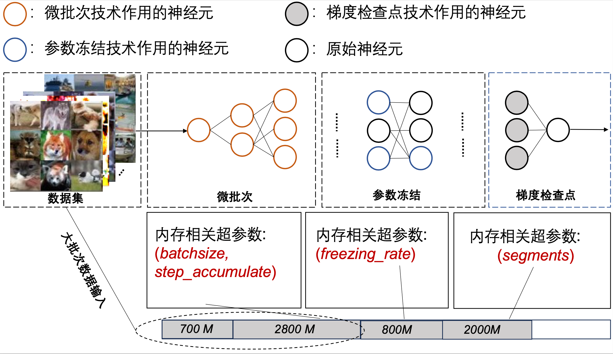

# 内存相关超参数调优器MPOptimizer


## 1 介绍

 MPOptimizer 可以针对部署于边缘端的DNN重训练任务中的动态输入分布和可用资源，优化内存相关超参数的配置。MPOptimizer 的核心组件是一个在线资源剖析器和一个规则引擎，前者能有效分析不同内存相关超参数配置的资源和准确性，后者能根据不同规则快速搜索大型配置空间。MPOptimizer在PyTorch上实现，并与最先进的边缘侧内存优化技术进行了对比评估，证明了它在模型精度性能方面的改进。

现提供以下模型支持：

- [ResNet](https://openaccess.thecvf.com/content_cvpr_2016/html/He_Deep_Residual_Learning_CVPR_2016_paper.html): 该模型由多个卷积层和池化层组成，用于提取图像信息。通常情况下，ResNet 会出现梯度消失/爆炸问题，当网络深度较深时，性能会下降。因此，ResNet 增加了 BatchNorm 来缓解梯度消失/爆炸问题，并增加了残差连接来缓解性能下降问题。

- [MobileNet](https://arxiv.org/abs/1801.04381): MobileNet 是一种轻量级卷积网络，广泛使用深度可分离卷积。
- [ResNeXt](https://arxiv.org/abs/1611.05431): ResNeXt 结合了 Inception 和 ResNet。它首先简化了 Inception 模块，使其每个分支都具有相同的结构，然后以 ResNet 风格构建网络。
- [MobileViT](https://github.com/chinhsuanwu/mobilevit-pytorch):MobileviT 是一款适用于移动设备的轻量级通用可视化Transformer模型。

## 2 如何开始使用

### 2.1 部署

#### 平台要求

- 边缘设备，如 Jetson AGX、Jetson TX2、Jetson Xavier NX 和 Jetson Nano
- Linux
- Python 3.8.5
- PyTorch 1.7.1
- CUDA 10.2+
- cuDNN 7.6.4
- Redis 6.0.10

#### **虚拟环境**

1. 创建 conda 环境并激活。

``````shell
conda create -n MPOptimizer python=3.8
conda active MPOptimizer
``````

2. 在 [官方网站](https://pytorch.org/) 上安装 PyTorch 1.7+。建议使用英伟达（NVIDIA）显卡和带有 CUDA 的 PyTorch。


3. 克隆该版本库并安装依赖项。

``````shell
git clone https://github.com/LINC-BIT/MPOptimizer.git
pip install -r requirements.txt
cd Docker/libtorch
touch Dockerfile
``````

### 2.2 使用方法

- **单一边缘设备**

  运行 MPOptimizer 或基线：

  ```````shell
  python pre_train_xxx.py
  python re_train.py
  python memonger.py
  python re_test.py
  ```````

```
python MPOptimizer/src/test.py --dataset [dataset] --model [model] 
--hyperparameters [hyper_parameters] --lr [lr] --task [task] 
--epoch [epoch] --store_rate [store_rate] --gpu [gpu]
```

标签解释:

- ``dataset``: 数据集，如 ``cifar10-c``, ``digits``, ``office-31``
- ``model``: 模型，如 ``ResNet-50``, ``ResNet-101``, ``MobileNet-v2``, ``MobileVit``
- ``hyperparameters``: 内存相关超参数，如 ``batchsize``, ``step_accumulate``, ``freezing_rate``, ``segment``
- ``lr``: 学习率
- ``task``: 任务数
- ``epoch``: 训练轮次
- ``store_rate``: 参数存储率
- ``gpu``: GPU id

## 3 支持模型

|      |                          Model Name                          |                          Data                          |                            Script                            |
| ---- | :----------------------------------------------------------: | :----------------------------------------------------: | :----------------------------------------------------------: |
| ☑    | [MobileViT (ICLR'22)](https://github.com/chinhsuanwu/mobilevit-pytorch) | [Cifar100](http://www.cs.toronto.edu/~kriz/cifar.html) | [Demo](https://github.com/LINC-BIT/MPOptimizer/model/MobileViT/re_train.py) |
| ☑    | [ResNet (CVPR'2016)](https://openaccess.thecvf.com/content_cvpr_2016/html/He_Deep_Residual_Learning_CVPR_2016_paper.html) | [Cifar100](http://www.cs.toronto.edu/~kriz/cifar.html) | [Demo](https://github.com/LINC-BIT/MPOptimizer/model/ResNet/re_train.py) |
| ☑    | [MobileNetV2 (CVPR'2018)](https://openaccess.thecvf.com/content_cvpr_2018/html/Sandler_MobileNetV2_Inverted_Residuals_CVPR_2018_paper.html) | [Cifar100](http://www.cs.toronto.edu/~kriz/cifar.html) | [Demo](https://github.com/LINC-BIT/MPOptimizer/model/MobileNet/re_train.py) |
| ☑    | [ResNeXt (CVPR'2017)](https://openaccess.thecvf.com/content_cvpr_2017/html/Xie_Aggregated_Residual_Transformations_CVPR_2017_paper.html) | [Cifar100](http://www.cs.toronto.edu/~kriz/cifar.html) | [Demo](https://github.com/LINC-BIT/MPOptimizer/model/ResNet/re_train.py) |

## 4 部署

### 4.1 内存相关超参数提取



MPOptimizer 将三种技术（微批处理、参数冻结和梯度检查点）整合到一个统一的模型中，并设置了一个允许动态调整这些技术的方案。它们被称为内存相关超参数，上图显示了每种技术的内存相关超参数，用户可以选择是手动调整还是使用MPOptimizer实现的自动搜索方案。

### 4.2 资源剖析算法

针对的目标重训练任务是基于已有预训练数据配置的。因此，如何有效利用预训练阶段获得的资源消耗数据来估算再训练阶段的在线资源消耗是MPOptimizer需要解决的主要问题。为此，MPOptimizer实现了资源剖析算法，以完成在线资源的快速估算。

```python
    def track(self):
        frameinfo = inspect.stack()[1]
        where_str = frameinfo.filename + ' line ' + str(frameinfo.lineno) + ': ' + frameinfo.function

        with open(self.gpu_profile_fn, 'a+') as f:

            if self.begin:
                f.write(f"GPU Memory Track | {datetime.datetime.now():%d-%b-%y-%H:%M:%S} |"
                        f" Total Tensor Used Memory:{self.get_tensor_usage():<7.1f}Mb"
                        f" Total Allocated Memory:{self.get_allocate_usage():<7.1f}Mb\n\n")
                self.begin = False

            if self.print_detail is True:
                ts_list = [(tensor.size(), tensor.dtype) for tensor in self.get_tensors()]
                new_tensor_sizes = {(type(x),
                                    tuple(x.size()),
                                    ts_list.count((x.size(), x.dtype)),
                                    np.prod(np.array(x.size()))*get_mem_space(x.dtype)/1024**2,
                                    x.dtype) for x in self.get_tensors()}
                for t, s, n, m, data_type in new_tensor_sizes - self.last_tensor_sizes:
                    f.write(f'+ | {str(n)} * Size:{str(s):<20} | Memory: {str(m*n)[:6]} M | {str(t):<20} | {data_type}\n')
                for t, s, n, m, data_type in self.last_tensor_sizes - new_tensor_sizes:
                    f.write(f'- | {str(n)} * Size:{str(s):<20} | Memory: {str(m*n)[:6]} M | {str(t):<20} | {data_type}\n')

                self.last_tensor_sizes = new_tensor_sizes

            f.write(f"\nAt {where_str:<50}"
                    f" Total Tensor Used Memory:{self.get_tensor_usage():<7.1f}Mb"
                    f" Total Allocated Memory:{self.get_allocate_usage():<7.1f}Mb\n\n")
```

### 4.3 精度增益算法

在进行内存相关超参数搜索时，传统方法一般不会考虑超参数对模型训练精度的影响。然而，对于训练本身非常不稳定的在线无监督重训练任务来说，这可能会导致准确率迅速下降，使训练结果变差。为此，MPOptimizer实现了一种精度增益算法，它在搜索内存相关超参数的同时，确保选择精度改进效率更高的超参数配置。

```python
def Aco(microbatch_size,checkpoint_size,freezing_rate):
    acc_i=get_acc()
	retrain(microbatch_size,checkpoint_size,freezing_rate,t)
    acc_f=get_acc()
    budget=budget-t
    return (acc_f-acc_i)/t
# return the accuracy gain
i=0
gain=dict()
for k in K_parameter:
    microbatch_size=k[0]
    checkpoint_size=k[1]
    freezing_rate=k[2]
    gain[i]=Aco(microbatch_size,checkpoint_size,freezing_rate)
    i=i+1

sorted(gain.items(),key=lambda x:-x[1])

while budget > t:
    for item,acc in gain.items():
        microbatch_size=K_parameter[item][0]
        checkpoint_size=K_parameter[item][1]
        freezing_rate=K_parameter[item][2]
        gain[item]=Aco(microbatch_size,checkpoint_size,freezing_rate)
        break
    sorted(gain.items(),key=lambda x:-x[1])
```

### 数据集

如果要整合一个新的数据集，可以这样做。步骤如下：

1. 创建一个类（继承自`benchmark.data.datasets.ab_dataset.ABDataset`），例如`class YourDataset(ABDataset)`

2. 使用`benchmark.data.datasets.registry.dataset_register(name, classes, classes_aliases)`注册数据集，其中包含数据集的名称、数据集的类以及类的可能别名。示例可参考 `benchmark/data/datasets/image_classification/cifar10.py` 或其他文件。

   请注意，"类 "的顺序必须与索引一致。例如，MNIST 的`classes `"必须是 `['0', '1', '2', ..., '9']`, 这意味着第 0 类是 "0"，第 1 类是 "1"，第 2 类是 "2"，...； `['1', '2', '0', ...]` 是不正确的，因为第 0 类不是 "1"，第 1 类不是 "2"。

   如何获取数据集的 "类"？对于 PyTorch 内置的数据集 (CIFAR10、MNIST, ...)和由 `ImageFolder` 构建的一般数据集，你可以初始化它 (例如 `dataset = CIFAR10(...)`) 并通过 `dataset.classes` 获得它的类。

   ```python
   # How to get classes in CIFAR10?
   from torchvision.datasets import CIFAR10
   dataset = CIFAR10(...)
   print(dataset.classes)
   # copy this output to @dataset_register(classes=<what you copied>)
   
   # it's not recommended to dynamically get classes, e.g.:
   # this works but runs slowly!
   from torchvision.datasets import CIFAR10 as RawCIFAR10
   dataset = RawCIFAR10(...)
   
   @dataset_register(
   	name='CIFAR10',
       classes=dataset.classes
   )
   class CIFAR10(ABDataset):
       # ...
   ```

3. 对于物体检测数据集，您可以读取注释JSON文件并在其中找到 `categories` 信息。

4. 实现抽象函数 `create_dataset(self, root_dir: str, split: str, transform: Optional[Compose], classes: List[str], ignore_classes: List[str], idx_map: Optional[Dict[int, int]])`.

   标签解释:

   - `root_dir`: 数据的地址
   - `split`: `train / val / test`
   - `transform`: torchvision.transforms`中的预处理函数
   - `classes`: 与 `dataset_register.classes`相同的值
   - `ignore_classes`: **类应该被丢弃。 您应该删除属于这些忽略类的图像。**
   - `idx_map`: **将原始类索引映射到新类索引。 例如，“{0: 2}”表示第 0 个类的索引将为 2 而不是 0。您应该通过修改原始数据集中存储的标签来实现这一点。**

   您应该在此函数中做这五件事：

   ```
   1.如果没有传递用户定义的变换，则应该实现默认变换
   2.创建原始数据集
   3.如果原始数据集中存在被忽略的类，则删除被忽略的类
   4.如果有索引映射，则将原始类索引映射到新类索引
   5.将原始数据集拆分为train / val / test dataset。如果原始数据集中没有val数据集（例如DomainNetReal），则应将原始数据集拆分为 train / val / test dataset。如果原始数据集中已有val数据集（例如CIFAR10和ImageNet），则将原始val数据集作为测试数据集，并将原始train数据集拆分为train / val dataset。
   ```

   例子:
   
   ```python
   @dataset_register(
       name='CIFAR10', 
       # means in the original CIFAR10, 0-th class is airplane, 1-st class is automobile, ...
       classes=['airplane', 'automobile', 'bird', 'cat', 'deer', 'dog', 'frog', 'horse', 'ship', 'truck'], 
       task_type='Image Classification',
       # means 'automobile' and 'car' are the same thing actually
       class_aliases=[['automobile', 'car']],
       shift_type=None
   )
   class CIFAR10(ABDataset):    
       def create_dataset(self, root_dir: str, split: str, transform: Optional[Compose], 
                          classes: List[str], ignore_classes: List[str], idx_map: Optional[Dict[int, int]]):
           # 1. if no user-defined transform is passed, you should implemented the default transform
           if transform is None:
               transform = cifar_like_image_train_aug() if split == 'train' else cifar_like_image_test_aug()
               self.transform = transform
           # 2. create the original dataset
           dataset = RawCIFAR10(root_dir, split != 'test', transform=transform, download=True)
           
           # 3. remove ignored classes in the original dataset if there are ignored classes
           dataset.targets = np.asarray(dataset.targets)
           if len(ignore_classes) > 0: 
               for ignore_class in ignore_classes:
                   dataset.data = dataset.data[dataset.targets != classes.index(ignore_class)]
                   dataset.targets = dataset.targets[dataset.targets != classes.index(ignore_class)]
           
           # 4. map the original class index to new class index if there is index map
           if idx_map is not None:
               for ti, t in enumerate(dataset.targets):
                   dataset.targets[ti] = idx_map[t]
           
           # 5. split the original dataset to train / val / test dataset.
           # there is not val dataset in CIFAR10 dataset, so we split the val dataset from the train dataset.
           if split != 'test':
               dataset = train_val_split(dataset, split)
           return dataset
   ```

## 5 实验设置

#### 5.1 边缘端重训练任务的精度性能

##### 5.1.1 数据集介绍

- CIFAR-10-C: CIFAR-10-C 数据集包含 15 个不同类别的损坏，例如高斯噪声、模糊、雪、霜、雾、对比度等。 每个腐败类别包括 5 个严重级别，从而提供了一组多样化的具有挑战性的评估场景。
- **Homepage**:https://github.com/hendrycks/robustness
- **Source code**: [`tfds.image_classification.Cifar10Corrupted`](https://github.com/tensorflow/datasets/tree/master/tensorflow_datasets/image_classification/cifar10_corrupted.py)
- **Download size**: `2.72 GiB`

##### 5.1.2 重训练任务

下面将介绍如何在 CIFAR-10-C 数据集上运行重训练任务：

- 将 CIFAR-10-C 数据集拆分为不同的域适应任务：

```
python src/dataset.py -cifar10_c
```

- 执行预训练神经网络任务

```
python src/pre-train.py
```

- 进行领域适应重训练任务

```
python src/re-train.py
```

- 基准测试的准确性验证

```
python src/re_test.py
```

##### 5.1.3 超参数分析

- 资源分析

```
python estimator/gpu_mem_track.py
```

- 精度分析

```
python estimator/accuracy_estimator.py
```

#### 5.2 迁移学习任务

##### 5.2.1 数据集介绍

- Office-31: Office 数据集包含三个领域的 31 个对象类别： 亚马逊、数码单反相机和网络摄像头。数据集中的 31 个类别包括办公环境中常见的物体，如键盘、文件柜和笔记本电脑。亚马逊领域平均每类包含 90 张图片，共计 2817 张图片。由于这些图像是从在线商家的网站上捕获的，因此它们都是在干净的背景下以统一的比例捕获的。数码单反相机领域包含 498 幅低噪声高分辨率图像（4288×2848）。每个类别有 5 个对象。每个对象平均从不同视角拍摄 3 次。对于网络摄像头，795 幅低分辨率（640×480）图像显示出明显的噪点、色彩和白平衡伪影。
- **下载地址**:https://faculty.cc.gatech.edu/~judy/domainadapt/

##### 5.2.2 如何运行

- 将 Office-31数据集拆分为不同的迁移学习任务：

```
python src/dataset.py -office_31
```

- 运行预训练任务

```
python src/pre-train-office.py
```

- 运行迁移学习任务

```
python src/re_train_office.py
```

- 测试精度

```
python src/re_test_office.py
```

#### 5.3 手写数字辨识

##### 5.2.1 数据集介绍

- Digits: 该数据集由 1797 张 8x8 图像组成。如下图所示，每张图像都是手写数字。为了利用这样一张 8x8 的图片，我们必须首先将其转换为长度为 64 的特征向量。
- **下载地址**:https://archive.ics.uci.edu/ml/machine-learning-databases/optdigits/

##### 5.2.2 如何运行

- 分割Digits数据集

```
python src/DigitModel.py
```

- 运行预训练任务

```
python src/pre-train-svnh.py
python src/pre-train-usps.py
```

- 运行重训练任务

```
python src/re_train.py
```

- 测试精度

```
python src/re_test_svnh.py
```

#### 5.4 图像分割大模型

MPOptimizer在先前工作 EdgeTA 的基础上，在 Hugging Face 中对大型模型实施了内存优化支持工作。包括 Vision Transformer、CLIP、SAM、GLIP、GPT-Neo 等。其中，CLIP 的预训练时间较短，便于用户测试，这里重点介绍该工作的运行过程，其余工作用户可参考目录文件自行测试。

- 实验设置

**模型**。以 Hugging Face 中基于 CLIP 的图像分类模型为例，说明如何将 Hugging Face FM 与 MPOptimizer 连接起来。

**数据集。** 我们使用数据集 [GTA5](https://link.springer.com/chapter/10.1007/978-3-319-46475-6_7) 和 [SuperviselyPerson](https://supervise.ly/) 作为源域，使用数据集 [Cityscapes](https://openaccess.thecvf.com/content_cvpr_2016/html/Cordts_The_Cityscapes_Dataset_CVPR_2016_paper.html) 和 [BaiduPerson](https://ieeexplore.ieee.org/abstract/document/6976983) 作为目标域。我们通过裁剪和保存分割边界框中的图像，将这些语义分割数据集转换为图像分类数据集。

- 前端预训练工作

依次运行以下命令，对知识库和索引进行预训练：

`````shell
python Big_model/new_impl/cv/clip/cls.py
python Big_model/new_impl/cv/clip/cls_md_wo_fbs.py
python Big_model/new_impl/cv/clip/cls_md_index.py
//Note that the file path of the model checkpoint in last two files should be modified manually.
`````

- 在线重训练阶段

运行以下命令，对 MPOptimizer 在不断变化的数据中的表现进行评估：

``````
python estimator/gpu_mem_track.py
python estimator/accuracy_estimator.py
python Big_model/new_impl/cv/clip/cls_online.py
``````

